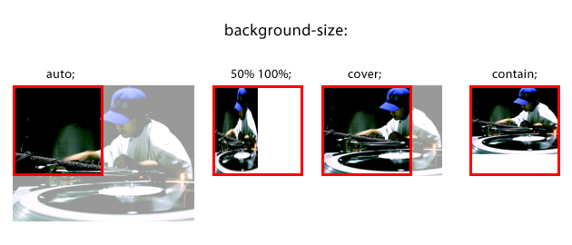
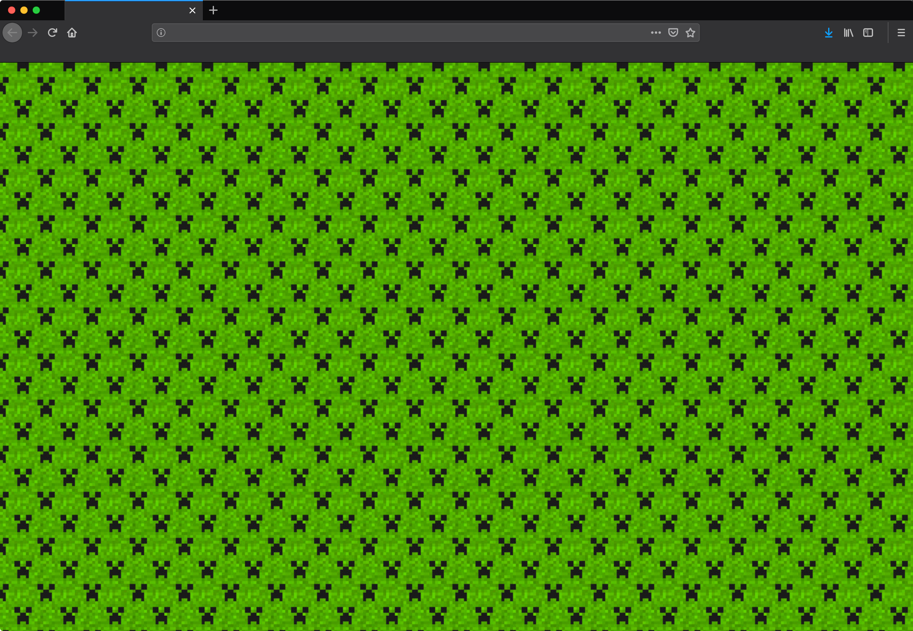
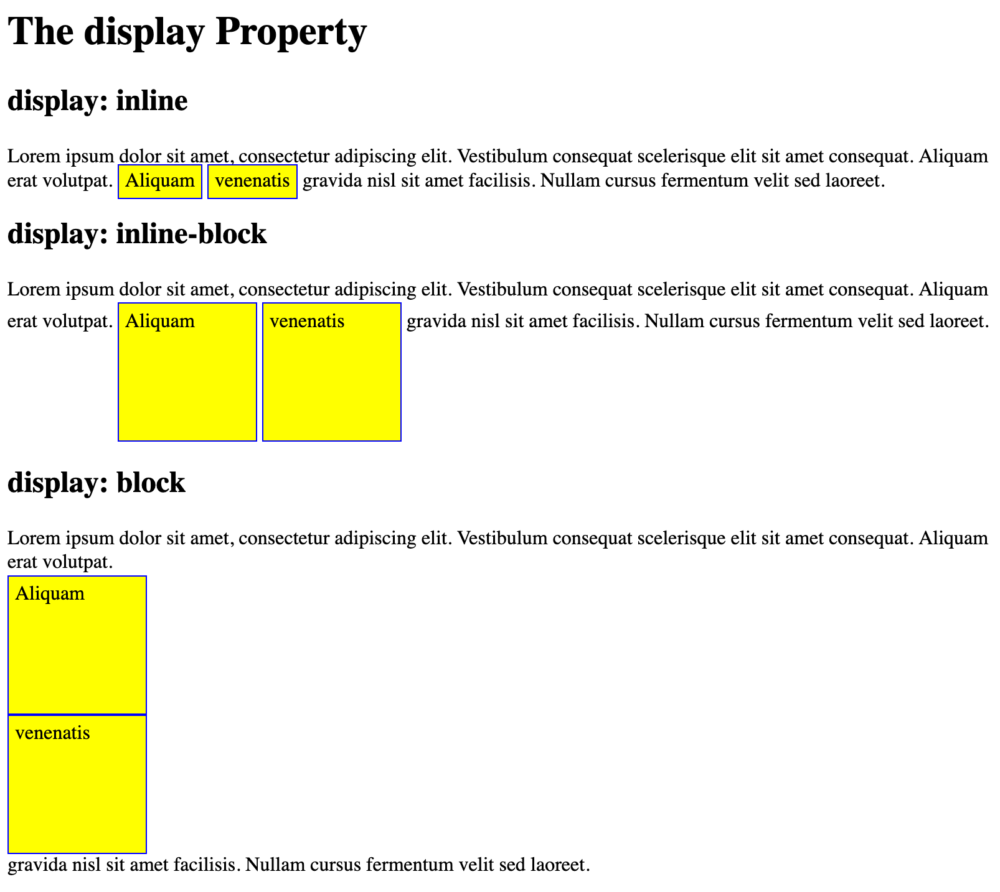

<!-- omit in toc -->
# Les propriétés CSS

Alors, on va faire au plus court, car des propriétés il y en a beaucoup... vraiment beaucoup. On va en voir quelques-une très rapidement, il vous faudra fouiller la documentation CSS pour en trouver d'autre ou chercher des exemples sur [Codepen](http://www.codepen.io) (ou autre). N'hésitez pas non plus a faire des recherches Google pour trouver ce que vous souhaitez comme effet.

<!-- omit in toc -->
## Table des matières

- [Typographie](#typographie)
  - [font-family](#font-family)
  - [font-size](#font-size)
  - [font-weight](#font-weight)
  - [font-style](#font-style)
  - [line-height](#line-height)
  - [color](#color)
  - [text-align](#text-align)
  - [text-transform](#text-transform)
  - [text-decoration](#text-decoration)
- [Bordure et arrière-plan](#bordure-et-arrière-plan)
  - [border](#border)
  - [border-radius](#border-radius)
  - [background-color](#background-color)
  - [background-image](#background-image)
  - [background-size](#background-size)
  - [background-repeat](#background-repeat)
  - [background-position](#background-position)
  - [background-attachment](#background-attachment)
  - [En une ligne](#en-une-ligne)
- [Dimensions, margin et padding](#dimensions-margin-et-padding)
  - [Inline et block](#inline-et-block)
  - [width & height (max & min)](#width--height-max--min)
  - [margin & padding](#margin--padding)
- [Display](#display)
  - [display: block](#display-block)
  - [display: inline](#display-inline)
  - [display: inline-block](#display-inline-block)
  - [display: none](#display-none)
- [Positionnement](#positionnement)
  - [float](#float)
  - [clear](#clear)
  - [Z-index](#z-index)
- [Position](#position)
  - [position: static](#position-static)
  - [position: fixed](#position-fixed)
  - [position: absolute](#position-absolute)
  - [position: relative](#position-relative)
- [L'auto-complete de VSCode](#lauto-complete-de-vscode)

## Typographie

### font-family

```css
body{
  font-family: Arial, Helvetica, sans-serif;
}
```

Cette propriété définit la famille de police d'écriture à utiliser. Dans cet exemple, tout texte dans le `body` de votre page utilisera Arial en priorité, ensuite Helvetica si la police n'est pas disponible et pour finir n'importe quelle police sans-serif si les deux première ne sont pas sur l'ordinateur de l'utilisateur.

Voici une liste des polices dites "safe" à utiliser sur vos pages web: [https://www.cssfontstack.com/]

> :bulb: Mettez les liens dont on vous parle en favoris sur votre navigateur pour pouvoir les consulter plus tard en cas de besoin

Il est également possible d'utiliser les [polices Google](https://fonts.google.com/), qui sont très nombreuses. Les intégrer n'est pas très compliqué, on verra cela plus tard, mais si vous voulez essayer, n'hésitez pas!

[:arrow_up: Revenir au top](#table-des-matières)

### font-size

```css
body{
  font-size: 18px;
}
```

Définit la taille (hauteur) d'une police. On peut utiliser plusieurs unités (px, em,...)

[:arrow_up: Revenir au top](#table-des-matières)

### font-weight

```css
body{
  font-weight: bold;
}
```

Définit l'épaisseur de notre police. Vous pouvez utiliser une valeur (de 100 à 900) ou un mot clé (bold, thin, normal,...), jetez un coup d'oeil aux propriétés complète [ici](https://www.w3schools.com/cssref/pr_font_weight.asp)

[:arrow_up: Revenir au top](#table-des-matières)

### font-style

```css
body{
  font-style: italic;
}
```

Permet de mettre les élements en **italique** ou en **oblique**

[:arrow_up: Revenir au top](#table-des-matières)

### line-height

```css
body{
  line-height: 1.5
}
```

Permet de gérer l'interlignage. C'est à dire l'espacement entre deux  lignes de paragraphes.

[:arrow_up: Revenir au top](#table-des-matières)

### color

```css
body{
  color: red;
}
p{
  color: #222222;
}
a{
  color: rgba(255,0,0,0);
}
```

Définit la couleur de l'élément. Prends un **valeur hexadécimale**, **RGBA** ou **un mot-clé** (red, gray,...)

[:arrow_up: Revenir au top](#table-des-matières)

### text-align

```css
p{
  text-align: right;
}
```

Permet d'aligner le texte. Les valeurs sont: **left**, **right**, **center**, **justify** (comme sur Word).

> :bulb: Pour aligner une image, on peut la mettre dans un \<div> ou \<p> qui est aligné avec **text-align**, on verra comment "mieux" aligner une image plus tard.

[:arrow_up: Revenir au top](#table-des-matières)

### text-transform

```css
h1{
  text-transform: capitalize;
}
```

Permet de modifier le texte pour le mettre en majuscule ou en minuscule. Prends les valeurs: **none**, **capitalize**, **uppercase**, **lowercase**

[:arrow_up: Revenir au top](#table-des-matières)

### text-decoration

```css
p{
  text-decoration: underline;
}
```

Ajoute différentes "décoration" au texte comme le soulignement. Les valeurs possible sont: **none**, **overline**, **underline**, **line-through**

[:arrow_up: Revenir au top](#table-des-matières)

## Bordure et arrière-plan

### border

```css
h2{
  border: 5px solid #6f1be4;
}
```

Border prend 3 sous-propriétés:

* `width` : l'épaisseur du contour en px
* `style`: le style: `solid` (ligne continue), `dotted` (pointillés),... [D'autre styles sont possible](https://www.w3schools.com/cssref/pr_border-style.asp)
* `color`: la couleur de la bordure

> :bulb: On peut divisier la bordure en 4 côté
>
> border-top: ...;
>
> border-bottom: ...;
>
> border-left: ...;
>
> border-right: ...;

[:arrow_up: Revenir au top](#table-des-matières)

### border-radius

```css
h2{
  border: 5px;
  border-radius: 10px;
}
```

Définit un arrondis pour la bordure. Ne sert à rien si la propriété **border** n'est pas présente.

> :bulb: Comme pour la bordure, il est possible de définir un arrondis que pour certains coins avec la syntaxe suivante: `border-top/bottom-left/right-radius`
>
> On peut aussi écrire cela de façon plus simple: `border-radius: 2px 20px 5px 14px;` La première valeur commence en haut à gauche, puis suit les coins dans le sens horloger.

[:arrow_up: Revenir au top](#table-des-matières)

### background-color

```css
h2{
  background-color: red;
}
```

Permet de définir un fond de couleur pour le bloc sélectionné.

[:arrow_up: Revenir au top](#table-des-matières)

### background-image

```css
div{
  background-image: url("img/bg.png");
}
```

Place une image en arrière-plan du bloc sélectionné.

[:arrow_up: Revenir au top](#table-des-matières)

### background-size

```css
body{
  background-size: cover;
}
```

Permet de gérer la taille de notre image grâce à : **auto**, **cover**, **contain**,...



### background-repeat

```css
body{
  background-repeat: no-repeat;
}
body{
  background-repeat: repeat-x;
}
```




Définit la répétition d'une image d'arrière-plan si le conteneur est plus grand que l'image. Prends les valeurs suivantes: **no-repeat**, **repeat-x**, **repeat-y**, **repeat**.

> :link: Un site qui génère des [patterns repeat à utilisé en background](https://pattern.monster/), mais sans image, tout est généré en CSS
>
> :link: Des [textures répétable](https://www.toptal.com/designers/subtlepatterns/) pour vos fonds de page

[:arrow_up: Revenir au top](#table-des-matières)

### background-position

```css
body{
  background-position: center;
}
```

Permet de donner la position de l'image de fond par rapport au coin haut gauche. S'utilise avec **no-repeat**

[:arrow_up: Revenir au top](#table-des-matières)

### background-attachment

```css
body{
  background-attachment: fixed;
}
```

Permet de faire défilé ou non l'image de background avec la page ou non. Par défaut la valeur est: **scroll**

[:arrow_up: Revenir au top](#table-des-matières)

### En une ligne

Il est possible d'insérer toutes les propriétés de background sur une seule ligne pour gagner en place dans votre code.

```css
body{
  background: #6f1be4 url("img/image.png") no-repeat center;
}
```

[:arrow_up: Revenir au top](#table-des-matières)

## Dimensions, margin et padding

### Inline et block

Sans CSS, les éléments d'un block prennent toute la largeur de leur parent et sont suivis d'un retour à la ligne (body, html, p, div,...)

Les éléments inline (span, a, strong, img,...) prennent la largeur de leur contenu et ne sont pas suivis d'un retour à la ligne.



[:arrow_up: Revenir au top](#table-des-matières)

### width & height (max & min)

> width = largeur
>
> height = hauteur

Prends comme valeurs: **auto**, **px**, **%** ou **em**

Il est également possible de préciser une valeur minimum ou maximum pour ces tailles.

```css
img{
  max-width: 100px;
}
```

> Dans cet exemple, l'image ne ferra jamais plus de 100 px de large.

[:arrow_up: Revenir au top](#table-des-matières)

### margin & padding


```css
// On aura des marges équivalente de chaque côté
.same{
  margin: 10px;
  padding: 5px;
}
  // On peut sélectionner chaque marge séparément
.different{
  margin-top: 10px;
  margin-bottom: 10px;
  margin-left: 5px;
  margin-right: 2px;
}
  // On peut sélectionner chaque marge séparément mais en une seule ligne en commençant par celle du haut puis en suivant le sens horloger
.different-but-one-line{
  margin: 10px 2px 10px 5px;
}
  // On peut sélectionner les marges du top et bottom et du left et right.
.different-one-line-two-values{
  margin: 10px 5px;
}
```

Ce qu'il faut retenir:

- `Padding`: marge intérieur
- `Margin`: marge extérieur
- Par défaut la valeur s'applique sur chaque côté (top, right, bottom, left) mais il est possible de préciser une valeur différente pour chaque côté.
- Peut s'écrire en une seule ligne (top, right, bottom, left)

[:arrow_up: Revenir au top](#table-des-matières)

## Display

Cette propriété va permettre une mise en forme avancée. Voici quelques valeurs possibles: **block**, **inline**, **inline-block**, **none**,... Certaines de ces valeurs sont appliquées par défaut en fonction des éléments (par exemple un `<p>` ou un `<div>` prend par défaut un **display:block**)

[:arrow_up: Revenir au top](#table-des-matières)

### display: block

```css
a{
  display: block;
}
```

Permet de changer les éléments **inline** en block. Par défaut il prend toute la largeur de son parent et est suivi d'un retour à la ligne.

Peux être modifié en **width** et **height**.

[:arrow_up: Revenir au top](#table-des-matières)

### display: inline

```css
p{
  display: inline;
}
```

Permet de transformer l'élément en type inline ce qui aura pour effet de le laisser sur une seule ligne.

Ne peux pas être modifié en **width** et **height**.

[:arrow_up: Revenir au top](#table-des-matières)

### display: inline-block

```css
p{
  display: inline-block;
}
```

Peux être modifié en **height** mais pas en **width**.

[:arrow_up: Revenir au top](#table-des-matières)

### display: none

```css
img{
  display: none;
}
```

Permet de retirer un élement de la page. Il ne sera plus visible et ne prendra plus de place. 

[:arrow_up: Revenir au top](#table-des-matières)

## Positionnement

### float

```css
.img{
  float:left;
}
```

Permet de placer un contenu en dehors du "flux" de la page et le reste des blocks "coule" autour. Prends **left**, **right** ou **none** comme valeur.


[:arrow_up: Revenir au top](#table-des-matières)

### clear

```css
.texte{
  clear: both;
}
```

Permet d'empêcher le contournement des blocs flottants. Prends **left**, **right** ou **both** comme valeur.


[:arrow_up: Revenir au top](#table-des-matières)

### Z-index

Permet de définir la position en "profondeur" d'un élément. La valeur par défaut étant `0`, si on met une valeur positive l'élément sera par dessus tous ceux qui sont à 0 et si on met une valeur négative l'élément sera en dessous de ceux qui sont à 0.

```css
img{
  z-index:1;
}
```

[:arrow_up: Revenir au top](#table-des-matières)

## Position

Cette propriété permet de positionner les éléments dans la page. Prends comme valeurs: **static**, **relative**, **absolute** ou **fixed**

### position: static

Valeur par défaut de tous les éléments. Un élément avec position static n'est positionné d'aucune manière spéciale.

[:arrow_up: Revenir au top](#table-des-matières)

### position: fixed

```css
.nav {
  position:fixed;
  top: 0;
  left: 0;
  right: 0;
}
```

Un élément positionné avec **fixed** ne bougera pas. Il sortira du flux de la page et se positionnera par dessus les autres éléments et ce même si on fait défiler la page. Sa position est définie par rapport à l'espace affichable par le navigateur.

[:arrow_up: Revenir au top](#table-des-matières)

### position: absolute

Un élément en `position:absolute` se placera par rapport à son parent direct. 

```css
h2 {
  position: absolute;
  left: 100px;
  top: 150px;
}
```

### position: relative

Si l'on veut placer un élément par rapport à un autre, on va mettre ce dernier en `position:relative`.

```css
.content .a {
  position: relative;
}

.content .b {
  position: absolute;
  right: 0;
  top: 0;
}
```

Un élément se comporte de la même manière que avec static. On peut se servir des propriétés **top**, **left**, **right**, **bottom** pour déplacer l'élément. Le reste du contenu ne sera pas affecté.

Pour mieux comprendre les positions, voici un lien vers [la documentation de cette balise sur W3School](https://www.w3schools.com/css/css_positioning.asp). Il y a pleins d'exemples.

[:arrow_up: Revenir au top](#table-des-matières)

## L'auto-complete de VSCode

Si vous ne savez pas exactement quelle propriété existe ou comment elle s'écrit, VSCode est là pour vous aider. En effet quand vous travaillez dans un document CSS ou HTML enregistré, VSCode détecte votre syntaxe et vous aide à compléter votre frappe.

Passons à quelques [exercices intermédiaires](10-exercices-intermediaires-css.md) pour assimiler tout ça.

[:arrow_up: Revenir au top](#table-des-matières)

[:rewind: Retour au sommaire du cours](./README.md#table-des-matières)
