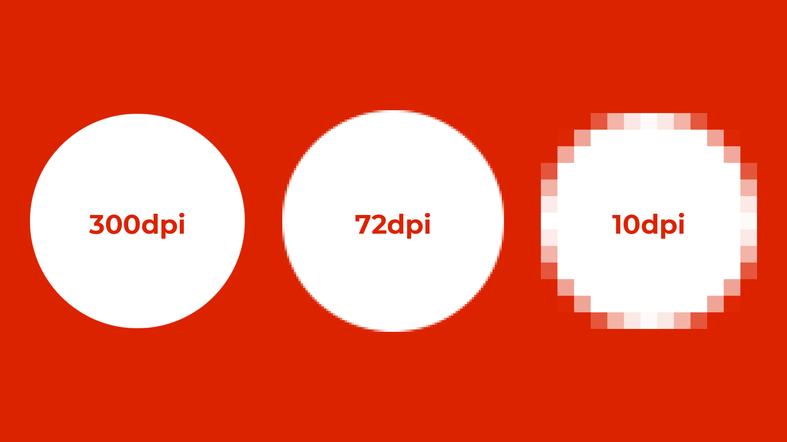
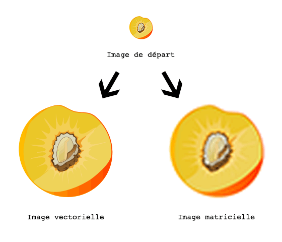
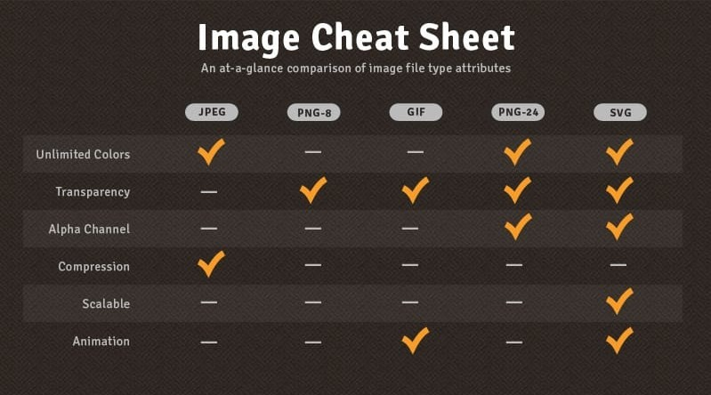

<!-- omit in toc -->
# Différents types de fichiers

L'informatique est remplit de type de fichiers différents, qu'on parle de fichier texte, image, de tableur, de page internet, d'archives,... chacun à son extension! Voyons ensemble quelques uns des formats que l'on va rencontrer pendant ce cette initiation.

<!-- omit in toc -->
## Table des matières

- [Fichier image](#fichier-image)
  - [Résolution d'une image](#résolution-dune-image)
  - [Image Vectorielle vs Matricielle](#image-vectorielle-vs-matricielle)
  - [Formats fichier image](#formats-fichier-image)
  - [Sources](#sources)
- [Fichier web](#fichier-web)

## Fichier image

### Résolution d'une image

Quand on parle de résolution, on parle du nombre de pixels par pouce (ppp ou dpi). Plus cette résolution est élevé, plus l'image sera de bonne qualité. Les deux résolution dont en parle le plus souvent sont **72dpi** ou **300dpi**. 

Lorsqu'on crée des images pour le web, on utilise le 72dpi, ce qui est la norme pour avoir des images de bonne tailles et qualité sans pour autant avoir des fichiers trop volumineux. 

Si on veut imprimer une affiche géante, on va devoir plutôt utiliser une résolution de 300dpi.

[:arrow_up: Revenir au top](#différents-types-de-fichiers)

### Image Vectorielle vs Matricielle

Voyons un peu la différence entre ces deux termes. Il est fort probable que vous vous ayez déjà entendu parler de pixels mais sans doute moins des vecteurs.

-**matricielle**: il s'agit d'une image constitué de pixels. Ce sont despetits carrés qui, une fois mis l'un à côté de l'autre, forment une image. Chaque carrés à sa couleur définit. Plus la résolution est élevé plus leur nombre est important et plus leurs taille est petite, et donc plus l'image sera de meilleur qualité. Si vous déformez cette image, cela va étirer les pixels et vous aurez une image floue.

-**vectorielle**: une image vectorielle est une suite de segment formé par des points qui sont définis par des formules mathématique. N'ayez crainte, pas besoin de savoir faire des maths pour créer des images vectorielles. L'avantage est que chaque élément à sa place et que si on veut agrandir l'image cela aura pour effet de recalculer la position des segments et ainsi conservé la qualité de l'image original. Le vectoriel est ce qu'on utilise pour réaliser des affiches de plusieurs mètres par exemple.

[:arrow_up: Revenir au top](#différents-types-de-fichiers)

### Formats fichier image

Une image peut être créer dans différents formats tels que **.jpg, .jpeg, .gif, .png, .svg,...** Chaque format à sa particularité, par exemple le **jpg** ne permet pas la transparence, le **gif** peut-être animé et transparent, le **png** ne peut-être animé mais propose la gestion de la transparence. Ces formats ont également leurs propre taux de compression, le **jpg** proposera toujours des images moins lourdes mais "de moins bonne qualité" que le **png**. Bref, chaque format à son utilisation.

[:arrow_up: Revenir au top](#différents-types-de-fichiers)

### Sources

Les formats vu plus haut sont tous des formats "exploitable" sur le web, c'est à dire que vous pouvez les intégrer à vos pages de votre site, dans un email, sur votre fil d'actualité Facebook ou Instagram. A contrario, il existe des types de fichiers dit "sources" qui sont des fichiers que vous ne pouvez pas afficher dans vos contenus. Ceux-ci sont là pour vous permettre d'éditer de nouveau vos contenu pour en changer la taille, la couleur, les formes,...

Chaque logiciel graphique à son propre fichier source, nous allons voir les deux principaux que nous utiliseront lors de cette formation, mais il en existe autant que de logiciels différent. 

- **psd**: PhotoShop Document, il stock toutes les options disponible dans le logiciel. Cela inclut les calques et leurs masques, la transparence, le texte, les couches alpha, les couleurs, les segments, les filtres,... Cela permet d'avoir toujours accès aux modifications apportés à nos contenus en cas de correction nécessaire. 
- **ai**: Adobe Illustrator, un peu comme le psd, ce fichier stock toutes les options du programme dans un fichier pour pouvoir éditer de nouveau l'illustration crée.

[:arrow_up: Revenir au top](#différents-types-de-fichiers)

## Fichier web

