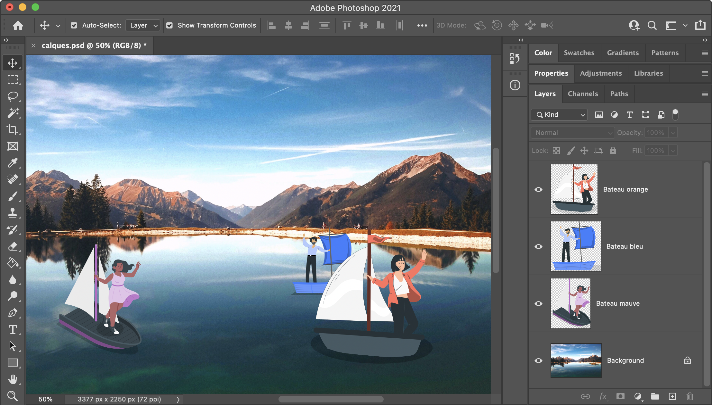
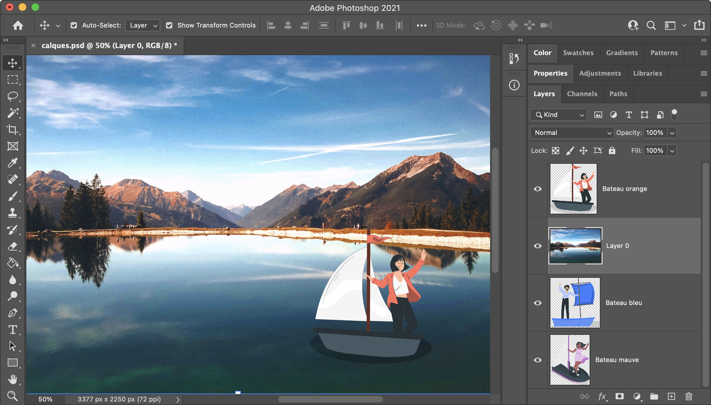
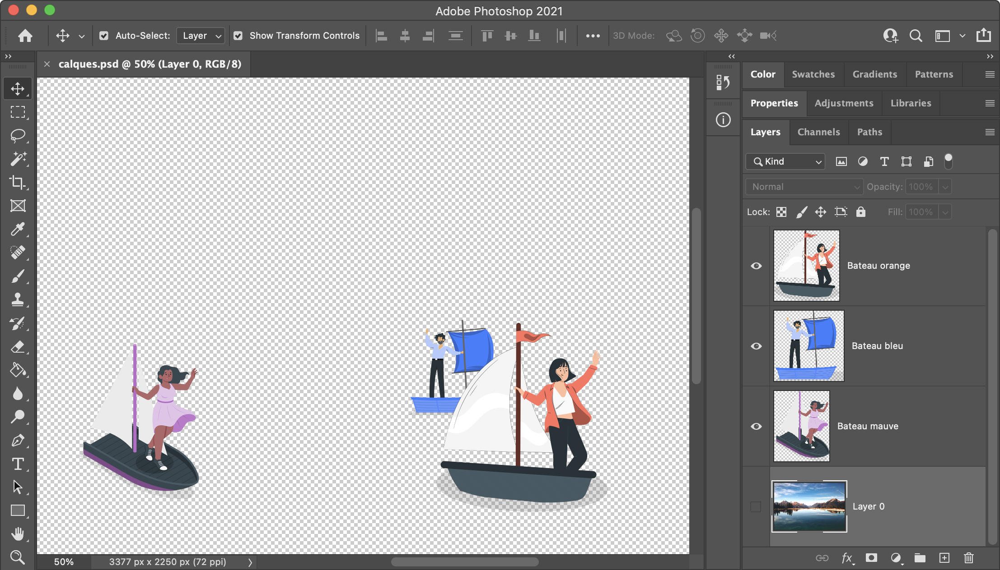

<!-- omit in toc -->
# Les Fondamentaux

Dans les prochaines sessions de cours nous allons utiliser des logiciels tels que **Photoshop** et **Illustrator**. Voyons quelques principes fondamentaux à la bonne compréhension des cours qui vont suivre.

<!-- omit in toc -->
## Table des matières
- [Le système de calques](#le-système-de-calques)

## Le système de calques

Si je vous parle de couche cela devrait vous aider à mieux comprendre les calques, après tout le terme en anglais est "layer". 


Il faut imaginer qu'un calque c'est une feuille transparente, sur cette feuille on peut "dessiner" ce que l'ont veut. Ensuite on peut superposer une autre feuille transparente avec un autre dessin, et ainsi de suite. Lorsqu'on ajoute toutes ces feuilles l'une sur l'autre cela forme une image. L'ordre est super important, en fonction de qui est au plus haut dans la liste et qui est au plus bas, certains détails apparaîtront ou non.



Dans l'exemple ci-dessous, j'ai juste remonté le calque de la photo de fond entre les différents personnages. Du coup, comme le bateau avec le personnage orange est toujours au dessus, celui-ci apparaît, les autres sont cachés en-dessous du fond.



Pour encore mieux comprendre le principe, voici un autre exemple où j'ai caché la photo. Vous pouvez voir du coup un fond en damier composé de carré blanc et gris. C'est un fond que Photoshop utilise pour nous signaler que cette partie là est transparente.



Vous pouvez retrouver le ```.psd``` utilisé en exemple en [le téléchargeant ici :floppy_disk:](https://mega.nz/file/ZgFm1BTT#Zgor1Lz1Stvvydos4KEF-8sA7fEXWAvxirti5P5jxIA)

Voici également un lien vers un tuto [Adobe Photoshop](https://helpx.adobe.com/be_fr/photoshop/how-to/ps-layers-basics.html) qui explique plus en profondeurs l'utilisations des calques. Pas de panique, nous verrons cela ensemble.

[:arrow_up: Revenir au top](#table-des-matières)

##