<!-- omit in toc -->
# Adobe Photoshop

Créé en 1990 par la société Adobe (prononcé "Adobi"), Photoshop est devenu le logiciel star de la retouche et création numérique. Nombres de films et séries y font référence tellement il est ancré dans la culture générale.

Le logiciel à eu nombres de versions, à l'heure de ces lignes nous sommes à la version 22.4.3. C'est énorme! Évidement il n'est pas question ici de faire un historique de toutes les versions et leurs différents apports. Sachez juste que la version 1 du logiciel était évidement très basique, et que désormais on a droit à des outils utilisant l'intelligence artificielle pour nous aider dans certaines tâches. Le bon technologique est énorme.

Si ça vous intéresse il y a pléthore de vidéo sur Youtube qui en parle, en voici quelques-unes:

- [Thomas Knoll, un des créateurs de Photoshop recré la première démo qu'il a fait du logiciel :uk:](https://youtu.be/Tda7jCwvSzg)
- [Des artistes VFX utilisent Photoshop 1 :uk:](https://youtu.be/8LkUzVexLTU)
- [Un graphiste utilise Photoshop 1 :uk:](https://youtu.be/ftaIzyrMDqE)

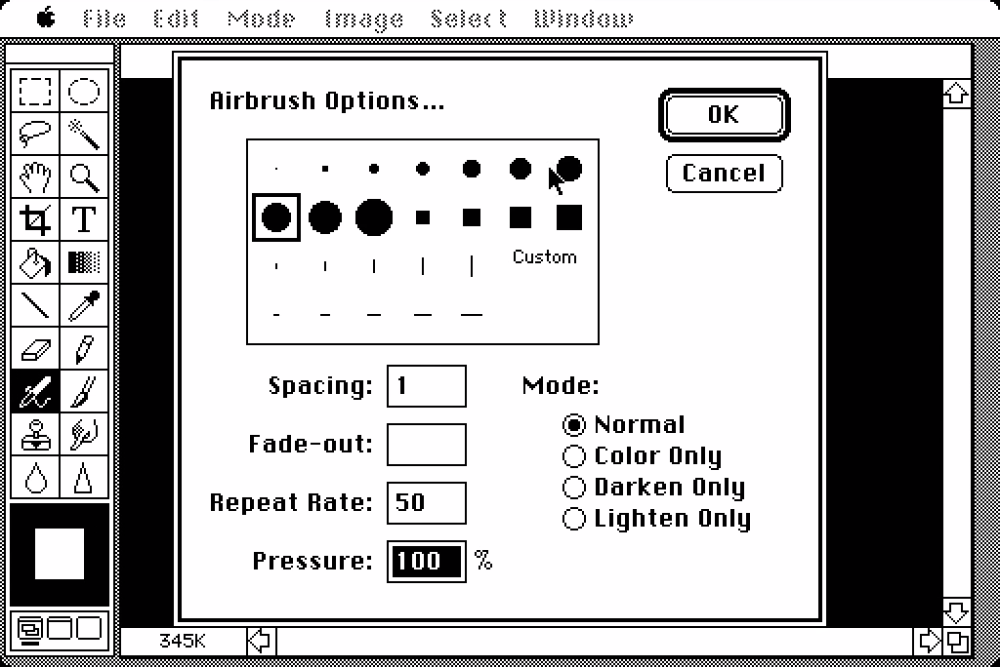

> La fenêtre de l'outil pinceau en 1990

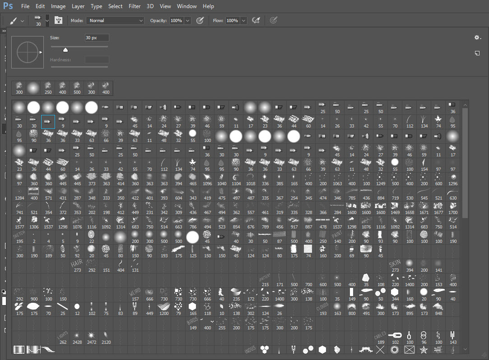

> La fenêtre de l'outil pinceau en 2021

<!-- omit in toc -->
## Table des matières 
- [Créer un nouveau document](#créer-un-nouveau-document)
- [L'interface](#linterface)
  - [La gestion des interfaces](#la-gestion-des-interfaces)
- [Les outils principaux](#les-outils-principaux)
  - [Sélection](#sélection)
  - [Pipette](#pipette)
  - [Recadrage](#recadrage)
  - [Pinceau (brush)](#pinceau-brush)
  - [Pot de peinture](#pot-de-peinture)
  - [Dégradé](#dégradé)
  - [Retouches](#retouches)
  - [Pipette](#pipette-1)
- [Ouvrir / Importer une image](#ouvrir--importer-une-image)
- [Détourage](#détourage)
- [Calques de réglages](#calques-de-réglages)
- [Filtres](#filtres)
- [Exercices](#exercices)

## Créer un nouveau document

Lançons Photoshop et créons notre premier fichier. Pour ce faire cliquez sur le bouton ```Créer nouveau```

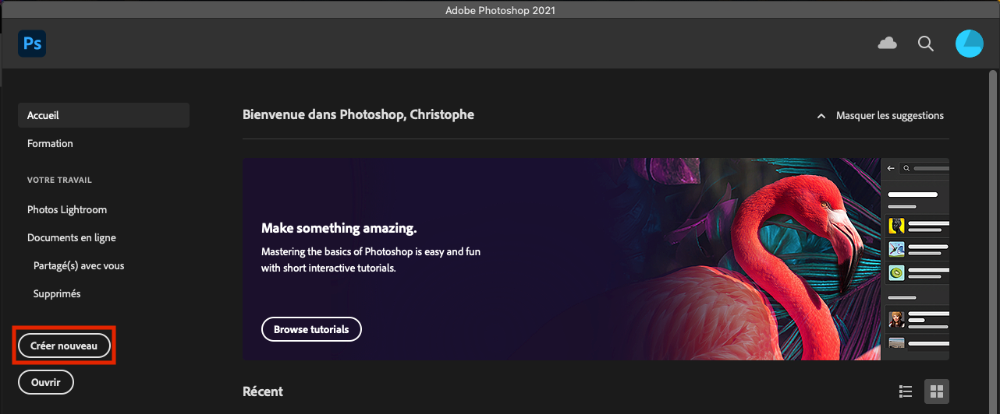

S'ouvre ensuite une nouvelle fenêtre qui permet de créer notre nouveau document.

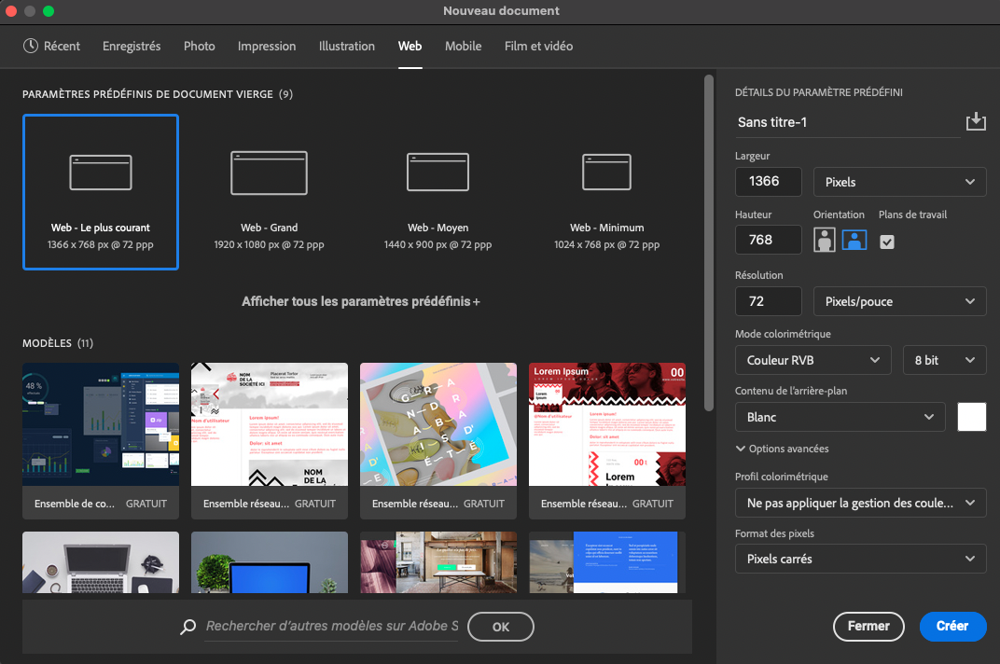

Ce qui nous importe ici c'est le menu du haut avec les différents préréglages (Photo, Impression, Illustration, Web, Mobile,...). C'est là que l'on peut retrouver des formats de fichiers courants.

Sélectionnons le réglage ```"Web - Le plus courant"```. Vous pouvez remarquer que dans la partie de droite de la fenêtre les dimensions, la résolution et d'autres paramètres se sont adaptés. Donnons également un titre à notre document. Puis on peut cliquer sur ```Créer```

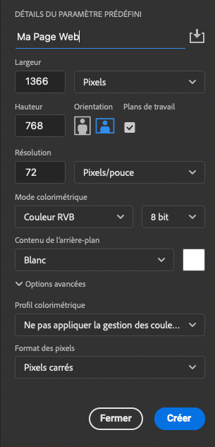

Et voilà on a notre nouveau document.

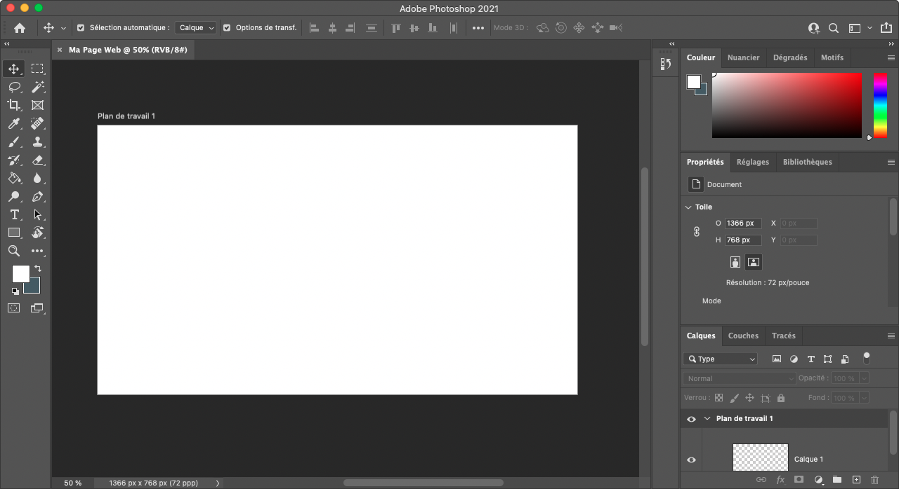

[:arrow_up: Revenir au top](#table-des-matières)

## L'interface

Intéressons-nous maintenant à l'interface. Elle est modulable selon vos désirs. A force de travailler dans Photoshop vous allez déplacer les différents panneaux pour mieux convenir à votre façon de travailler. Voyons comment l'interface est découpé lors du premier démarrage de Photoshop.

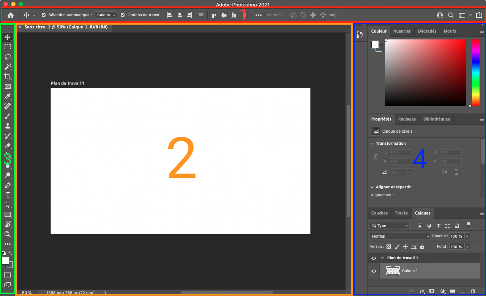

1. **La barre des options:** C'est ici que vous pouvez retrouvez les options principales de l'outil en cours. Cette barre change donc dynamiquement en fonction de l'outil sélectionné. Sur la partie de droite vous pouvez aussi retrouvez des options rapides de connexion mais surtout la gestion de vos interfaces. Plus d'infos là dessus dans un instant
2. **La fenêtre Document:** C'est ici que vous allez avoir la vue sur votre création. 
3. **Le panneau d'outils:** Le panneau le plus important, sauf pour ceux qui connaissent tous les les raccourcis, ce sont tous les outils disponibles dans Photoshop. Nous verrons certains d'entre-eux plus loin dans ce cours.
4. **Les panneaux:** Alors ici c'est un peu particulier car au final ce sont les panneaux affichés par défaut, mais vous pouvez mettre ce que vous voulez comme panneaux. Parmi les panneaux intéressants on a par exemple celui des ```Calques```, des ```Couches```, des ```Couleurs```, des ```Réglages```, et encore tellement d'autres. Nous verrons l'utilité de certains un peu plus loin dans ce cours.


### La gestion des interfaces

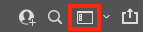

Si vous cliquez sur cette icône vous devriez avoir une liste des différentes interfaces pré-définies dans Photoshop. Cela permet de changer la disposition des panneaux en fonction de l'utilité du logiciel que vous faites sur le moment. Le plus simple est de travailler avec ```Les Indispensables``` au début. Mais vous pouvez changer à tout moment. Ce qui est intéressant c'est de pouvoir ```Réinitialiser *l'interface*``` au cas où vous avez perdu vos panneaux.

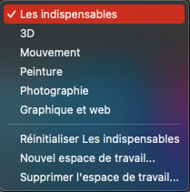

Il est également possible d'enregistrer votre espace de travail, par exemple avec une configuration pour quand vous êtes sur 2 écrans. Car oui, il est possible de placez vos panneaux en dehors de l'interface.

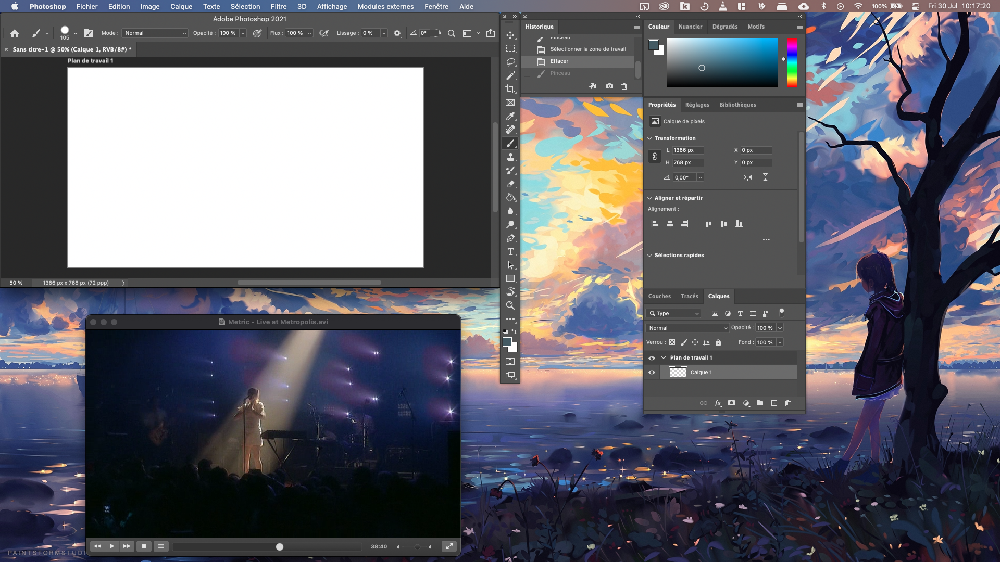

Vous pouvez gérez tous vos panneaux dans le menu ```Fenêtre```. Vous retrouverez de nouveau les options pour gérer votre espace de travail mais aussi l'affichage ou non d'un panneau, ainsi qu'une option pour réorganiser vos fenêtres. N'hésitez pas à parcourir toutes ces options à votre rythme.

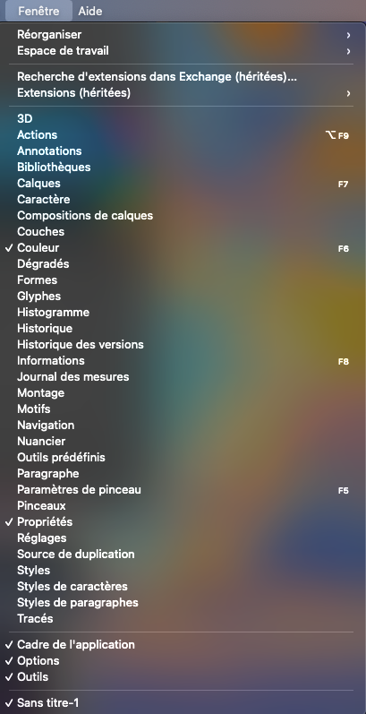

[:arrow_up: Revenir au top](#table-des-matières)

## Les outils principaux

in

### Sélection


### Pipette

### Recadrage

### Pinceau (brush)

### Pot de peinture

### Dégradé

### Retouches

### Pipette

[:arrow_up: Revenir au top](#table-des-matières)

## Ouvrir / Importer une image

[:arrow_up: Revenir au top](#table-des-matières)

## Détourage

[:arrow_up: Revenir au top](#table-des-matières)

## Calques de réglages

[:arrow_up: Revenir au top](#table-des-matières)

## Filtres

[:arrow_up: Revenir au top](#table-des-matières)

## Exercices

[:arrow_up: Revenir au top](#table-des-matières)
