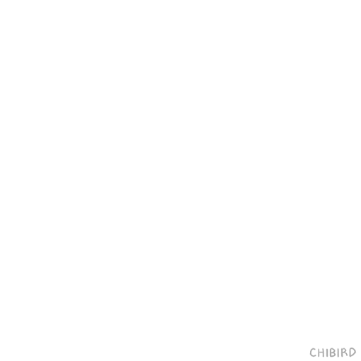

<!-- omit in toc -->
# Maquette City Night Life


Il est de nouveau temps pour toi de réaliser une maquette que ton client t'as envoyé.

Pour ce faire, utilise tout ce que tu as vu jusqu'à présent: html, css, flexbox, méthode de nommage, font awesome, google font, variables, import,...

## La maquette

Tu retrouveras tous les éléments nécessaires à la réalisation de cette maquette dans [le dossier suivant](https://drive.google.com/drive/folders/1BrBLKJwIF9wvsKgQ5brmJexUETOmMQ8e?usp=sharing).

## Consignes

- L'ensemble du site contient plusieurs **[flexbox](https://www.w3schools.com/css/css3_flexbox.asp)**
- Le fond de la page est un **[background-image](https://www.w3schools.com/css/css_background_image.asp)**
- Le container principal du site à une **[max-width](https://www.w3schools.com/cssref/pr_dim_max-width.asp)** de 1500px et un **[background-color](https://www.w3schools.com/cssref/pr_background-color.asp)** blanc.
- Le titre du site a un **background-color** dont la valeur est #1E1F23 et sa **color** est blanc.
- Le titre de l'article a un **background-color** dont la valeur est #1E1F23 et une propriété **[transform](https://www.w3schools.com/cssref/css3_pr_transform.asp)** de 2,5deg
- La font utilisée sur l'ensemble du site est Poppins, c'est une **[Google Font](https://fonts.google.com/)**
- Le fond de la partie galerie est de cette couleur: #1E1F23
- Le fond du titre de la page galerie est de cette couleur: #121315
- Le fond des trois dernières images est soit blanc soit #1E1F23

### Version tablet

- La largeur maximum du container principal est de 790px
- Il faut utiliser les **[Mediaqueries](https://www.w3schools.com/css/css_rwd_mediaqueries.asp)**
- Utilise la MQ pour les Medium devices ci-dessous

```css
/* Medium devices (landscape tablets, 768px and up) */
@media only screen and (min-width: 768px) {...}
```

- Utilise les **[imports](https://www.w3schools.com/cssref/pr_import_rule.asp)** en CSS pour séparer ton travail entre la version *desktop* et la version *tablet*

## Conseils

Cet exercice te semble peut-être bien compliqué, et pourtant, tu as vu toute la théorie nécessaire pour y arriver. Alors prend ton courage à deux mains et rappel toi les conseils que je t'ai donné.

- Procède étape par étape. Fixe toi un objectif simple pour commencer.
- Dessine la structure sous forme de bloc sur une feuille de papier avant de te lancer.
- Lis correctement les consignes, j'y ai glissé des liens vers la documentation de ce dont tu auras besoin pour réaliser cette maquette.
- Retourne lire la théorie donnée en cours.
- Utilise les **[variables CSS](https://www.w3schools.com/css/css3_variables.asp)** pour ne pas devoir tout le temps recopier les codes hexadécimaux
- Essaye d'allez le plus loin possible dans la réalisation de cette maquette. Il est toujours préférable de montrer un travail qui n'a pas tout le contenu mais dont le contenu présent est correctement mis en page.



[:arrow_up: Revenir au top](#table-des-matières)

[:rewind: Retour au sommaire du cours](./README.md#table-des-matières)
